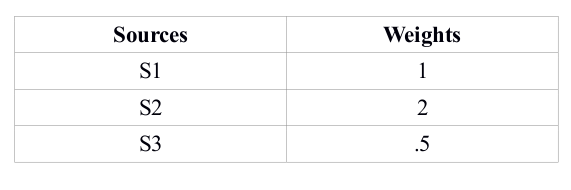

# Packet Queuing and Scheduling Algorithms
Packet Queuing and Scheduling Algorithms: FIFO, Round Robin and Weight Fair Queuing (WFQ)

We have simulated the below network model, and applied all the aforementioned algorithms on the router simulator.

 </img>

The simulator assumes three sources <b>S1, S2 and S3</b> which transmit at a specific rate, and send a given number of packets (see table below)

 </img>

Also, we assume the following weights assigned to the packets from the three different sources.

 </img>

Each source sends a payload, with the first byte indicating the source number i.e. "1ksdfsdfsdfu" implies that the packet arrived from S1. 